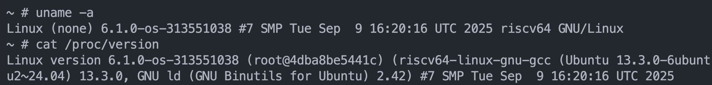
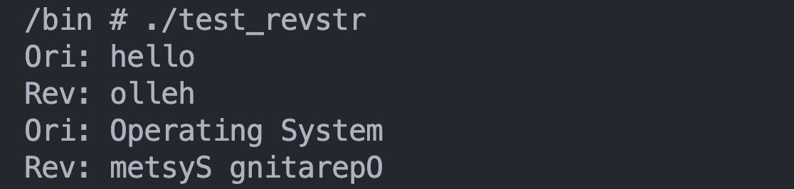
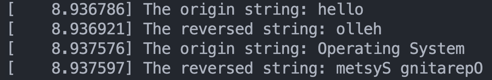
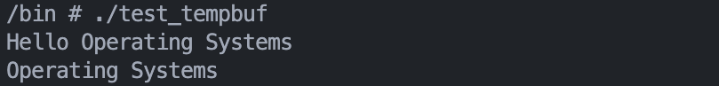

> 原始作業說明：[HackMD](https://hackmd.io/@fLANt9b6TbWx5I3lYKkBow/S17gcgmKxl)

# Assignment I - Compiling a Custom Linux Kernel & Implementing New System Calls
**[NYCU \[CSIC30015\] Operating System](https://timetable.nycu.edu.tw/?r=main/crsoutline&Acy=114&Sem=1&CrsNo=535503&lang=zh-tw) by Prof. [Chun-Feng Wu](https://www.cs.nycu.edu.tw/members/detail/cfwu417)**


<font color="#f00"> **Due Date: 23:59, October 22 (Wednesday), 2025** </font>

---
**Table of Contents**

[TOC]

---


## Goals
- Run a minimal Linux kernel for testing.
- Compile a custom Linux kernel from source.
- Add a new Linux system call.
- Create a kernel patch.


## Introduction
This semester, all three hands-on projects will involve working with the Linux kernel.
#### Kernel Documentation
The Linux kernel is open source and well-documented. The documentation can be found in the `Documentation/` directory at the root of the kernel source tree. You can build the documentation using the `make htmldocs` or `make pdfdocs` commands. Alternatively, there is an online version  for kernel **v6.1** available [here](https://www.kernel.org/doc/html/v6.1/index.html#) for all our assignments. Documentation for many other kernel versions can be found [here](https://www.kernel.org/doc/html/), with the latest version available [here](https://www.kernel.org/doc/html/latest/).

Additionally, different kernel versions' online source code is provided by [Bootlin](https://elixir.bootlin.com/linux/v6.11-rc6/source), which allows you to easily browse and trace the code through their website.

Please feel free to ask questions via email or on the forum if you have problem finding out the solution from the documentation provided.

## Environment Set-Up

::: info
**Note:** This environment will be reused in later assignments, so skipping this one may affect your progress in the following assignments.
:::

:::warning
**Warning:** If your host machine uses **Windows** as operating system, please use **WSL** to perform the tasks. https://learn.microsoft.com/en-us/windows/wsl/install
:::


### I. Docker

For this assignment, you will need a working Docker environment to compile the Linux kernel for a **RISC-V environment**

#### 1. Installation
First, you need to install Docker Compose on your machine. The easiest way is to follow the step-by-step instructions provided on the [official Docker website](https://docs.docker.com/compose/), which will guide you through the installation process for your operating system. Once Docker is installed, you should verify that the installation was successful with:

```bash
docker --version
```

#### 2. Building the container
In the directory with the provided `Dockerfile` and `docker-compose.yml`, run the following command to create the Docker container and begin working in the workspace.

```bash
# build the container
docker compose build

# start up the container in the background
docker compose up -d
```

After the container is started, the workspace will include a `docker/home/ubuntu/` directory, which is mounted to `/home/ubuntu` inside the container. You can copy files to and from this directory to transfer data between the host and the container.


#### 3. Getting into the container
You can access the container using either exec access or SSH.

##### a. Using `docker exec`
If you just need to get into the container shell directly, you can use the following commands.
```bash
# Start an interactive shell inside the running container
docker exec -it <container_name> /bin/bash

# Switch to the working directory
cd /home/ubuntu
```

##### b. Using SSH
During the first startup, the container is preconfigured to generate an SSH key pair automatically. The private key can be used for passwordless login into the container. 

```bash
ssh -i docker/home/ubuntu/.ssh/id_rsa -p 22025 ubuntu@localhost
```
:::    success
**Hint:** If you are prompted for a password, it usually means that the private key was not found. Make sure that you run the `ssh` command with administrator privileges and you run the command from the assignment directory.
::: 

If the setup was successful, you should now be greeted by the terminal as the `ubuntu` user.

#### 4. Container Management

You can use the following Docker commands outside the container to check and manage Docker processes.

```bash
# to list all currently running Docker containers
docker ps

# stop and remove containers, networks, and other resources
docker compose down

# to stop a running container
docker kill <containerID or name>

# to show detailed information
docker inspect <containerID or name>

# real-time view of container resource usage
docker stats
```

### II. Verifying the Environment
The container image has been preconfigured with the complete RISC-V toolchain, with the prefix `riscv64-linux-gnu-*`. Therefore, you only need to verify the installation with the following commands.

```bash
# check the cross-compiler version
riscv64-linux-gnu-gcc -v

# check QEMU for RISC-V system emulation
qemu-system-riscv64 --version
```

If the RISC-V toolchain is not available, you can install it by yourself.
```bash
sudo apt install gcc-riscv64-linux-gnu
```


### III. Downloading Linux source

Here, We clone the [mainline Linux Git repository](https://git.kernel.org/pub/scm/linux/kernel/git/torvalds/linux.git) (i.e., Linus Torvalds’ tree).
```bash
git clone https://github.com/torvalds/linux --branch v6.1 --depth 1
```
:::    info
**Note:** In our case, the compiled target is the release of **6.1 LTS kernel**. Using the arguments `--branch v6.1 --depth 1` avoids the download of all versions that are included in the Linux repository and only the version we care about in this assignment.
:::


This concludes the setup phase of the assignment. Next, we will go over the requirements and tasks to complete.

## Requirements

### I. Compiling a custom Linux Kernel

#### 1. Kernel Compilation (Do It Yourself!)
Now, begin your journey of compiling the Linux kernel! 
The required kernel source version is v6.1 LTS kernel (or v6.1.0), which is a Long-Term Support (LTS) maintained until December 2026. Moreover, the Civil Infrastructure Project (CIP) has adopted v6.1 as an SLTS (Super LTS) and plan to maintain it for 10 years, until August 2033.

We will not go through the kernel compilation steps here since there are numerous resources and documents available online.

:::success
**Hint:** Since the target platform is **RISC-V**, you must configure the **architecture flag** and **cross-compiler flag** correctly
:::

#### 2. Changing kernel local version

Before compiling the kernel, you need to modify the kernel local version suffix to `-os-<student ID>` (e.g. -os-313551000). This will serve as evidence that the kernel was built by you. To quickly check whether the kernel version string meets the requirements, you can run the following inside the container, even before starting QEMU:
```bash
make kernelrelease
```
This will output something like:
```bash
6.1.0-os-313551000
```

#### 3. Running a RISC-V Linux with QEMU

To run the system, you need two components:

- **Kernel Image** – the Linux kernel you compiled for RISC-V.
- **Initramfs** (`initramfs.cpio.gz`) – a minimal root filesystem provided in the homework materials.

Since the target is RISC-V, you will run the system in QEMU (`qemu-system-riscv64`), which provides full-system emulation. QEMU will boot using your custom Kernel Image together with the provided Initramfs.

```bash
qemu-system-riscv64 -nographic -machine virt \
  -kernel linux/arch/riscv/boot/Image \
  -initrd initramfs.cpio.gz \
  -append "console=ttyS0 loglevel=3"
```
::: info
**Note:** To quit a started QEMU session, press `Ctrl + A`, release both keys, and press  `X`.
:::


#### <font color="#f00">4. Requirement</font>

In your report, complete the following:
- **Include screenshot of the outputs of `uname -a` and `cat /proc/version`** to prove that you compiled the kernel by yourself. 
    - Example:

- **List the steps you took** to compile the kernel
- **Answer the Q&As**
    1. What are the main differences between the RISC-V and x86 architectures?
    2. Why do the architecture differences matter when building the kernel? What happens if you build the kernel without the correct RISC-V cross-compilation flag?
    3. Why is Docker used in this assignment, and what advantages does it provide? Please list at least two of them.

:::warning
**Warning:** If you do not include the above screenshot in your report, this item may receive a score of **zero**.
:::

### II. Implementing new System Calls
In this section, you are required to implement two new Linux system calls in the kernel v6.1 you have built: **`sys_revstr`** and **`sys_tempbuf`**

For guidance on adding system calls, refer to the [kernel documentation](https://www.kernel.org/doc/html/v6.1/process/adding-syscalls.html#generic-system-call-implementation). You may check [syscall(2)](https://man7.org/linux/man-pages/man2/syscall.2.html) to learn how to use `syscall` in linux system. Remember that we are using **RISC-V architecture** in this assignment, so please pay close attention to the implementation differences across architectures.

:::success
**Hint:** This [stackoverflow post](https://stackoverflow.com/questions/71551719/how-to-add-a-system-call-in-risc-v-linux) may be helpful.
:::


#### 1. `sys_revstr`
- **SYNOPSIS:**
```c
#include <unistd.h>

#define __NR_revstr 451
int syscall(__NR_revstr, char *str, size_t n);
```
    
- **DESCRIPTION:**
You are required to implement a system call named `sys_revstr`, which accepts two arguments: a string `str` and its length `n`. This system call should reverse the string and perform the following actions:
    1. Print a line "`The origin string: <str>`" to the **kernel ring buffer**, where `<str>` is the string the user passed in.
    2. Reverse the given string.
    3. Print a line "`The reversed string: <rev_str>`" to the **kernel ring buffer**, where `<rev_str>` is the resulting string you reversed.
    4. copy the result string to the user's space.
    5. Return zero to indicate successful execution.
:::info
**Note:** You don't need to handle invalid arguments such as a null pointer or mismatched string length.
:::


:::success
**💡Hint:** The data from the user space are not shared with the kernel space (and vice versa), so you need to figure out how to transfer data between them.
:::

:::success
**💡Hint:** Data printed to the kernel ring buffer must be written using kernel logging functions
:::
    

- **SAMPLE EXPLANATION:**
Ensure the following user-space code can be compiled and executed on your QEMU emulator.

```c
#include <unistd.h>
#include <string.h>
#include <stdio.h>
#include <assert.h>
    
#define __NR_revstr 451  // System call number 451 (revstr implementation)
    
int main(int argc, char *argv[]) {
    
    char str1[20] = "hello";
    printf("Ori: %s\n", str1);
    int ret1 = syscall(__NR_revstr, str1, strlen(str1));
    assert(ret1 == 0);
    printf("Rev: %s\n", str1);

    char str2[20] = "Operating System";
    printf("Ori: %s\n", str2);
    int ret2 = syscall(__NR_revstr, str2, strlen(str2));
    assert(ret2 == 0);
    printf("Rev: %s\n", str2);

    return 0;
}
```
The output of the above user-space program should look like this:




Check the kernel ring buffer with the `dmesg` command. You should see output similar to:




#### 2. `sys_tempbuf`
- **SYNOPSIS:**
```c
#include <unistd.h>

#define __NR_tempbuf 452 

enum mode{
    PRINT,  // Print all stored records to the kernel ring buffer
    ADD,    // Add a new record
    REMOVE  // Remove the first matching record
};

int syscall(__NR_tempbuf, enum mode, void *data, size_t size);
```
- **DESCRIPTION:**
You are required to implement a system call named `sys_tempbuf`, which manages a temporary list of strings inside the kernel. It allows user programs to add strings, remove specific strings, or print all stored strings. The system call accepts three arguments:
    - `mode`: selects the operation (`ADD`, `REMOVE`, `PRINT`)
    - `data`: a pointer to a user string 
    - `size`: the length of the string in `data`

    The behavior of each mode is described as follows:
    
    - **`ADD`**: 
        - Copies the given string from user space pointer `data` and appends it to **the end of the list** as one record
        - Also, prints a message to the **kernel ring buffer** in the form `[tempbuf] Added: <data>`, where `<data>` is the string the user passed in
    - **`REMOVE`**: 
        - Searches the list for the **first record that matches the given `data`**. If found, removes it. If there are multiple identical strings, **only the first match is removed**
        - Also, prints a message to the **kernel ring buffer** in the form `[tempbuf] Removed: <data>` if the record is found


    - **`PRINT`**: 
        - Concatenates all strings **in the list in the order they were inserted**. Each string is separated by exactly one space. Then, copies the result into the user-provided  `data` (up to `size` bytes) 
        - Also, prints the result to the **kernel ring buffer**. The message must begin with `[tempbuf]` , followed by the concatenated result
            - eg. Suppose the list has three records inserted in this order
                ```bash
                "foo"
                "bar"
                "baz"
                ```
                The buffer returned to user space via `data` should look like: 

                ```bash
                foo bar baz
                ```
               
- **RETURN VALUE** 
You must clearly define the return values of your system call:
    - For `ADD` / `REMOVE`, returns 0 on success
    - For `PRINT`, returns the number of actual characters copied into the user buffer, **excluding the terminating null character** (`'\0'`)
    - **On failure**: returns a negative error code
        - **`-EFAULT`**: Indicates that the user-provided pointer is not a valid user-space address, and the kernel failed to access it
            - `data == NULL` / `size == 0`
            - `data` points to an illegal/unmapped region
        - **`-ENOENT`**: Used only in `REMOVE` mode. Indicates that the requested string does not exist in the tempbuf list, so there is nothing to remove
        
:::info
**Note:** In the test cases, the output length produced by the `PRINT` operation will not exceed 512 bytes
:::

:::info
**Note:** You don't need to handle mismatched string length
:::
:::success
**Hint:** The Linux kernel provides a generic linked list implementation (`struct list_head`) that may be useful for managing records. You can refer to [this documentation](https://docs.kernel.org/core-api/list.html).
:::

    
- **SAMPLE EXPLANATION:**
Ensure the following user-space code can be compiled and executed on your QEMU emulator.
```c
#include <unistd.h>
#include <stdio.h>
#include <string.h>
#include <assert.h>
#include <errno.h>

#define __NR_tempbuf 452  // System call Nr 452 (tempbuf implementation)

enum mode {
    PRINT,
    ADD,
    REMOVE
};

int main() {
    char buf[512];
    int ret;

    ret = syscall(__NR_tempbuf, ADD, "Hello", strlen("Hello"));
    assert(ret == 0);

    ret = syscall(__NR_tempbuf, ADD, "Operating Systems", strlen("Operating Systems"));
    assert(ret == 0);

    memset(buf, 0, sizeof(buf));
    ret = syscall(__NR_tempbuf, PRINT, buf, sizeof(buf));
    assert(ret >= 0);
    printf("%s\n", buf);

    ret = syscall(__NR_tempbuf, REMOVE, "NotExist", strlen("NotExist"));
    assert(ret == -1 && errno == ENOENT);

    ret = syscall(__NR_tempbuf, REMOVE, "Hello", strlen("Hello"));
    assert(ret == 0);

    memset(buf, 0, sizeof(buf));
    ret = syscall(__NR_tempbuf, PRINT, buf, sizeof(buf));
    assert(ret >= 0);
    printf("%s\n", buf);

    return 0;
}
```

The output of the above user-space program should look like this:



Check the kernel ring buffer with the `dmesg` command. You should see output similar to:


#### 3. Running Your Test Programs in QEMU
After compiling your custom kernel with the new system calls, you need to test them inside QEMU with the provided `initramfs.cpio.gz`. Since QEMU runs with a minimal root filesystem, you must manually include your test programs into the initramfs image.

**a) Compile your test program**
Cross-compile the test program for RISC-V inside the Docker container:
```bash
riscv64-linux-gnu-gcc -static -o <test_program> <test_program.c>
```

**b) Place the binary into initramfs directory**
Extract the provided `initramfs.cpio.gz` into a temporary directory:
```bash
mkdir -p initramfs
cd initramfs
gzip -dc ../initramfs.cpio.gz | cpio -idmv
```
Then copy your test binary into wherever you want.

**c) Repack the initramfs**

After adding the file, repack the directory into a new initramfs image:

```bash
find . | cpio -o -H newc | gzip > ../initramfs.cpio.gz
cd ..
```

Next, follow Requirements I-3 to test the kernel image with QEMU.

#### <font color="#f00">4. Requirement</font>

In your report, complete the following:
- **Include four screenshots of the outputs**
    - The execution result of provided `test_revstr` user program for `sys_revstr`
    - The `dmesg` output of `sys_revstr`
    - The execution result of provided `test_tempbuf` user program for `sys_tempbuf`
    - The `dmesg` output of `sys_tempbuf`
- Explain **how you added system calls to your custom Linux kernel** and the **implementation details** of `sys_revstr` and `sys_tempbuf`
- **Answer the Q&As**
    1. What does the `include/linux/syscalls.h` do?
    2. Explain the difference between a system call and a glibc library call, then give one example that maps a glibc function to the specific system call it ultimately invokes.
    3. Explain the difference between static linking and dynamic linking
    4. In this assignment environment, why do we have to compile the test programs with the `-static` flag? What would happen if we omitted it?

    
### III. Patch
In Linux kernel development, the **email format patch** is widely used. Patches adhere to a specific format designed to facilitate review, application, and tracking within the kernel development process. After finishing the required changes to your kernel version, it is time to create your own patch. This patch will be used by the TAs to build the kernel with the system calls you implemented.

:::success
**💡Hint:** You can refer to the [git-format-patch(1)](https://man7.org/linux/man-pages/man1/git-format-patch.1.html) documentation for more information.
:::

:::info
**Note:** It's fine if you have many `.patch` files, depending on the number of commits. Just simply place all the `.patch` files in the `HW1_<student ID>/` folder.
:::

:::warning
**Warning:** Using an incorrect patch format may cause the TA to be unable to build your patch, resulting in a zero grade. Therefore, please make sure the format is correct.
:::


### IV. Package list
Since the `.config` file you set may require some packages to build the kernel you configured, use the following command to list the packages installed on your system:
```shell
$ dpkg --get-selections > packages_list_<student ID>.txt
```

    
## Grading

#### Total (100%)
- **Report (40%)**
    - I. Compiling a custom Linux kernel (20%)
        - Description (10%)
        - Q&As (10%)
    - II. Implementing new system calls (20%)
        - Description (10%)
        - Q&As (10%)
- **Implementations (60%)**
    - Kernel local version (20%)
        - we will use the `.config` you provide to build the kernel, and we will check whether you set the correct local version specified [here](##Requirements).
    - `sys_revstr` hidden test case (20%)
    - `sys_tempbuf` hidden test case (20%)


:::info
**Note:** Hidden test case are just like the provided test programs and have nothing special — we just want to prevent someone from simply printing the answer.
:::

## Submissions

#### 1. Required Files
- **Report**
    - Only `.pdf` file is accepted
    - Make sure your report meets all of the <font color="#f00"> **requirement**</font> above
    - Filename
        - `<student ID>_report.pdf` (e.g `313551000_report.pdf`)
- **Config File**
    - `.config` you used to build your kernel
- **Package List**
    - Filename
        - `packages_list_<student ID>.txt` (e.g `packages_list_313551000.txt`)
- **Patch file**
    - Filename
        - `0001-xxxx.patch` (e.g. `0001-Modify-Makefile.patch`)
        - `0002-xxxx.patch` (e.g. `0002-Add-the-revstr-syscall-definition.patch`)
        - `0003-xxxx.patch` (e.g. `0003-Implement-revstr-syscall.patch`)
        - ... ...
        - ... ...

Ensure you include all necessary files above for this assignment.

#### 2. Pack the required file
All your files should be organized in the following hierarchy and zipped into a `.zip` file, named `HW1_<student ID>.zip` (e.g. `HW1_313551000.zip`)

The structure inside the zipped file should be as the following:
```
HW1_<student ID>.zip 
    |- HW1_<student ID>/
        |- <student ID>_report.pdf
        |- .config
        |- packages_list_<student ID>.txt
        |- 0001-xxxx.patch
        |- 0002-xxxx.patch
        |- ......
        |- ......
        |- ......
```

e.g.
```
HW1_313551000.zip 
    |- HW1_313551000/
        |- 313551000_report.pdf
        |- .config
        |- packages_list_313551000.txt
        |- 0001-Modify-Makefile.patch
        |- 0002-Add-the-revstr-syscall-definition.patch
        |- 0003-Implement-revstr-syscall.patch
``` 
        
:::info
**Note:** It's fine if you have many `.patch` files, depending on the number of commits. Just simply place all the `.patch` files in the `HW1_<student ID>/` folder.
:::
    
:::warning
**DO NOT** include any files or directories not explicitly specified above in your archive, such as `__MACOSX`, `.git`, `.vscode`,  `.vscode-server`,etc., as they may potentially cause our automated build system to crash.
:::
    
#### 3. Submit the archive through the E3 platform before deadline.
If you have any questions about this assignment, please feel free to contact the TA or make an appointment by emailing os.oscarlab@gmail.com. You may also reach out to the TA during class.


:::danger
**Warning:** Incorrect file formats will result in a 20-point deduction. Additionally, if a formatting error prevents the TA from building your kernel, you may not receive any points.
:::


<!-- :::info
**Note1**: The TA is here to help clarify assignment questions and requirements, not to serve as your personal tutor or a tool for debugging your code and environment.
::: -->

:::danger
**Plagiarism Warning:** Plagiarism is strictly prohibited. Homework assignments must be completed **individually**. Assignments found to be plagiarized will receive reduced credit or, in most cases, **no credit**.
:::


## Additional Note
In formal kernel development, you should write a Kconfig file to allow users to decide whether to build your custom system call using menuconfig or by configuring the kernel via `scripts/config`. The configuration option might be named `NYCU_OS_AS1` or whatever you prefer. However, for this assignment, you are not required to do this. This task is an additional exercise for those interested.

For more detail about Kconfig, please refer [this Kernel Document](https://www.kernel.org/doc/html/v6.1/kbuild/kconfig-language.html).

