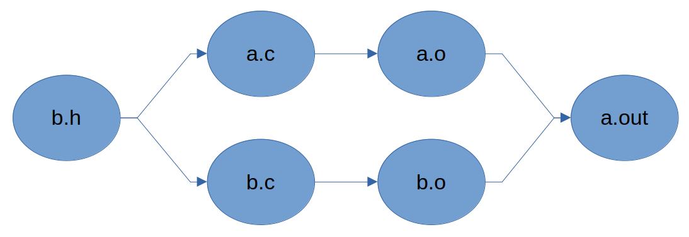

> 原始作業說明：[HackMD](https://hackmd.io/@seco1024/Bk48CgNClg)


# Assignment II: Scheduling Policy Demonstration Program

**[NYCU \[CSIC30015\] Operating System](https://timetable.nycu.edu.tw/?r=main/crsoutline&Acy=114&Sem=1&CrsNo=535503&lang=zh-tw) by Prof. [Chun-Feng Wu](https://www.cs.nycu.edu.tw/members/detail/cfwu417)**


<font color="#f00"> **Due Date: 23:59, November 19 (Wednesday), 2025** </font>

---
**Table of Contents**

[TOC]

---

<a id="org6943f28"></a>
:::warning
**[11/7 Update]**
Some students have reported encountering a *pthread error* when running the provided `sched_demo` test file. We have uploaded a corrected version. If you find that your current test file does not work properly, please re-download the updated version. We apologize for the inconvenience. 
:::


This assignment aims to implement a program to apply different scheduling policies on created threads and observe their behaviors.

<a id="org493f9b7"></a>

## Introduction

### Linux Scheduling Policy

The scheduling polices can be divided into four categories:

- **Fair scheduing policies**
  -   `SCHED_NORMAL` (CFS, `SCHED_OTHER` in POSIX), `SCHED_BATCH`
- **Real-Time scheduing policies**
  - `SCHED_FIFO`, `SCHED_RR`
-   **Idle scheduling policy**
    -   `SCHED_IDLE`
-   **Deadline scheduling policy**
    -   `SCHED_DEADLINE`

The default scheduling policy is `SCHED_NORMAL`.


As you are only required to set either of `SCHED_NORMAL` or `SCHED_FIFO` policy to a thread in this assignment, and `SCHED_NORMAL` has been covered in the course, we will introduce the real-time scheduling policy `SCHED_FIFO` here.

<a id="org8bb257a"></a>
### `SCHED_FIFO`

What exactly does `SCHED_FIFO` do?

- `SCHED_FIFO` is a simple real-time scheduling algorithm **without time slicing**.
-   When a `SCHED_FIFO` thread becomes runnable, it will **always immediately preempt** any currently running thread with fair scheduling policy.
-   Among threads that all use `SCHED_FIFO`, priority strictly determines order:
higher-priority threads always preempt lower-priority ones.

So, when does a `SCHED_FIFO` thread give up the CPU?

1. Blocked by an I/O request, changing state to `TASK_INTERRUPTIBLE` or `TASK_UNINTERRUPTIBLE`.
2. Preempted by other real-time thread with higher priority when the thread is in **ready state**.
3. Calls `sched_yield(2)` or `sleep(3)` to give up the CPU resource.

You can run `ps -eo state,uid,pid,ppid,rtprio,time,comm` on Linux to list processes with their real-time priorities:

```
$ ps -eo state,uid,pid,ppid,rtprio,time,comm
S   UID     PID    PPID RTPRIO     TIME COMMAND
I     0      13       2      - 00:00:00 rcu_tasks_rude_kthread
I     0      14       2      - 00:00:00 rcu_tasks_trace_kthread
S     0      15       2      - 00:00:00 ksoftirqd/0
I     0      16       2      1 00:00:03 rcu_preempt
S     0      17       2      1 00:00:00 rcub/0
S     0      18       2     99 00:00:00 migration/0
S     0      19       2     50 00:00:00 idle_inject/0
```

The `RTPRIO` represents "real-time policy priority", which ranges from 1 to 99. The process with the smallest value 1 has the lowest priority. On the other hand, the processes with "-" in their `RTPRIO` column means they are not real-time processes (or threads).

As you can see, the processes `rcu_preempt`, `rcub/0`, `migration/0` and `idle_inject/0` are all real-time processes with their priority values.

<a id="orgdef3574"></a>

### Reference

-   [sched(7) - Linux manual page](https://man7.org/linux/man-pages/man7/sched.7.html)


<a id="org6d6ee06"></a>

## Requirements

### Environment Setup

In this assignment, you will continue to use the same environment from **[Assignment 1]( https://hackmd.io/@fLANt9b6TbWx5I3lYKkBow/S17gcgmKxl)**, which runs RISC-V programs inside the provided Docker container using QEMU.

#### 1. Create a New Working Directory in Docker Container
After getting into the Docker container, create a new folder for this assignment:

```bash
cd /home/ubuntu
mkdir -p hw2
```

All your implementation files for this assignment can be placed here.

#### 2. Prepare Kernel and Root Filesystem

From Assignment 1, you should already have:
- **Kernel image**: `/home/ubuntu/linux/arch/riscv/boot/Image`
- **Root file system folder**: `/home/ubuntu/initramfs/ `

If these exist in another directory, you can simply reference them again for this assignment. There is no need to rebuild. 

#### 3. How to Run Test Program

After finishing your implementation for this assignment, you will need to:
- Cross-compile your program as `sched_demo_<student_id>` into the RISC-V architecture with GNU Make.
- Copy your compiled RISC-V program and provided testing scripts into your initramfs folder.
- Repack the initramfs.
    ``` bash
    cd /home/ubuntu/initramfs/
    find . | cpio -o -H newc | gzip > ../initramfs.cpio.gz
    cd ..
    ```
- Boot into QEMU using the updated initramfs image.
    ```
    qemu-system-riscv64 -nographic -machine virt -m 1024 -smp 4 \
  -kernel linux/arch/riscv/boot/Image \
  -initrd initramfs.cpio.gz \
  -append "console=ttyS0 loglevel=3"
    ```
- Before running the demo program, run the following command inside QEMU to disable RT throttling.
    ```bash
    echo -1 > /proc/sys/kernel/sched_rt_runtime_us
    ```

### Implementation

In this assignment, you are required to implement a program called `sched_demo_<student_id>`, which lets a user run multiple threads with different scheduling policies and show the working status of each thread.

```
$ ./sched_demo -n 4 -t 0.5 -s NORMAL,FIFO,NORMAL,FIFO -p -1,10,-1,30
Thread 3 is running
Thread 3 is running
Thread 3 is running
Thread 1 is running
Thread 1 is running
Thread 1 is running
Thread 2 is running
Thread 0 is running
Thread 2 is running
Thread 0 is running
Thread 2 is running
Thread 0 is running
```

The meanings of command-line arguments are:

-   `-n <num_threads>`: number of threads to run simultaneously
-   `-t <time_wait>`: duration of "busy" period
-   `-s <policies>`: scheduling policy for each thread, `SCHED_FIFO` or `SCHED_NORMAL`.
    -   The example `NORMAL,FIFO,NROMAL,FIFO` shown above means to apply `SCHED_NORMAL` policy to the 1st and 3rd thread and `SCHED_FIFO` policy to the 2nd and 4nd thread.
-   `-p <priorities>`: real-time thread priority for real-time threads
    -   The example `-1,10,-1,30` shown above means to set the value `10` to the 2nd thread and value `30` to the 4nd thread.
    -   You should specify the value `-1` for threads with `SCHED_NORMAL` policy.

The program can be divided into two sections: the main thread section and worker thread section.

<a id="org1664295"></a>

#### Main Thread

The main thread first needs to parse the program arguments, sets CPU affinity of all threads to **the same CPU**, and then creates `<num_threads>` worker threads specified by the option `-n`.

For each worker thread, attributes such as scheduling inheritance, scheduling policy and scheduling priority must be set. Next, the main thread will start all threads at once, and finally wait for all threads to complete.

```C
int main() {
    /* 1. Parse program arguments */

    /* 2. Create <num_threads> worker threads */
    
    /* 3. Set CPU affinity */

    for (int i = 0; i < <num_threads>; i++) {
        /* 4. Set the attributes to each thread */
    }
    /* 5. Start all threads at once */

    /* 6. Wait for all threads to finish  */ 
}
```

:::info
**Hint1** 💡:  [`getopt(3)`](https://man7.org/linux/man-pages/man3/getopt.3.html) can be used to parse command-line options.
:::
:::info
**Hint2** 💡: Some useful functions:
- [`sched_setaffinity(2)`](https://man7.org/linux/man-pages/man2/sched_setaffinity.2.html)/[`pthread_setaffinity_np(3)`](https://man7.org/linux/man-pages/man3/pthread_setaffinity_np.3.html): Set CPU affinity
- [`sched_setparam(2)`](https://man7.org/linux/man-pages/man2/sched_setparam.2.html)/[`pthread_attr_setschedparam(3)`](https://man7.org/linux/man-pages/man3/pthread_attr_setschedparam.3.html): Set scheduling parameters
- [`sched_setscheduler(2)`]([sched_setscheduler(2)](https://man7.org/linux/man-pages/man2/sched_setscheduler.2.html))/[`pthread_attr_setschedpolicy(3)`](https://man7.org/linux/man-pages/man3/pthread_attr_getschedpolicy.3.html): Set scheduling policy
:::

:::info
**Hint3** 💡: Start all threads one by one, like, in step 4, will have high probability producing incorrect outputs. You may want to see [`pthread_barrier_wait(3p)`](https://man7.org/linux/man-pages/man3/pthread_barrier_wait.3p.html) to synchronize threads.
:::

<a id="org014851d"></a>

#### Worker Thread

Each newly-created worker thread must wait for other threads before executing its task. Then the thread runs the loop for 3 times.

In each loop, it shows a message indicating it's starting and performs the busy work for `<time_wait>` seconds specified by the `-t` option. Finally, it exits the function.

```C
void *thread_func(void *arg)
{
    /* 1. Wait until all threads are ready */

    /* 2. Do the task */ 
    for (int i = 0; i < 3; i++) {
        printf("Thread %d is running\n", <id-of-the-current-thread>);
        /* Busy for <time_wait> seconds */
    }
    /* 3. Exit the function  */
}
```

:::warning
**Warning** :warning:: You can't use `sleep(3)` or `nanosleep(3)` functions to achieve busy waiting, which just makes the thread to enter sleeping state and put it into the ready queue to be scheduled after the specified time. 
:::

:::info
**Hint** 💡: The time it spends in the busy wait should exclude the time that the thread is being preempted. You could use the `time` command to time your process. It should be around $\text{Time given} \times \text{Process count} \times 3 (\text{seconds})$
:::
<a id="org9c16395"></a>
## Makefile Mini Tutorial

**GNU Make** is a really handy tool for compiling large programs with just a short command `make`. The part before the ':' is usually called the target, the part after the ':' is called the dependencies of the target, and the part indented after them is called the recipe. Below is an example Makefile:
```=Makefile
# indicating that target "all" and "clean" are not files
.PHONY: all clean

# set some variables
CC= gcc
CFLAGS= -Wall -Wextra -Werror -O3 -Wpedantic
OUTPUT_OPTION= -MMD -MP -o $@

SOURCE= a.c b.c
OBJS= $(SOURCE:.c=.o)
DEPS= $(SOURCE:.c=.d)
TARGET= a.out

# first command of make
all: $(TARGET)

# import the dependencies of .h .c files from the compiler
-include $(DEPS)

# implicit targets
# %.o: %.c
#        $(CC) $^ -o $@ -c $(CFLAGS)

$(TARGET): $(OBJS)
    $(CC) $^ -o $@

clean:
    @rm -f $(TARGET) $(OBJS) $(DEPS)
```

```
    |- test/
        |- a.c
        |- b.c
        |- b.h
        |- Makefile
----after running command make----
    |- test/
        |- a.c
        |- b.c
        |- b.h
        |- a.d
        |- b.d
        |- a.o
        |- b.o
        |- a.out
        |- Makefile
----after running command make clean----
    |- test/
        |- a.c
        |- b.c
        |- b.h
        |- Makefile
```

|  |
|:---------------------------------------------------:|
|          Dependency graph of the Makefile           |

If the dependencies of the target was not changed and the target is older than those of the dependencies, the recipe will not be run again.

:::warning
**Reminder**: Don’t forget — in this assignment, your program must be compiled for the RISC-V architecture,
because it will be executed inside the RISC-V QEMU virtual machine. You should use the cross-compiler provided in the Docker environment.
:::

:::success
**Reference**
* [Youtube reference ~1hr](https://youtu.be/WFLvcMiG38w?si=-A-LnayK4jwDstV8)
* [GNU Make Manual](https://www.gnu.org/software/make/manual/make.html)
:::

<a id="org9c16394"></a>

## Test

You can download the example program `sched_demo` and the test script `sched_test.sh` from E3 to test your program.

There are 3 public testcases by default. If your program passes all testcases, it will show the message "Success!" for each testcase.

```sh
$ ./sched_test.sh ./sched_demo ./sched_demo_<student_id>
Running testcase 1: ./sched_demo -n 1 -t 0.5 -s NORMAL -p -1......
Result: Success!
Running testcase 2: ./sched_demo -n 2 -t 0.5 -s FIFO,FIFO -p 10,20......
Result: Success!
Running testcase 3: ./sched_demo -n 3 -t 1.0 -s NORMAL,FIFO,FIFO -p -1,10,30......
Result: Success!
```
:::success
**Note**: Remember to give the executable and script permission to execute with the command
`chmod +x sched_demo `
`chmod +x sched_test.sh`
:::

However, if your program fails any testcases, the test script will exit immediately and print the message "Failed..." with the `diff` results between two programs.

```sh
$ ./sched_test.sh ./sched_demo ./sched_demo_<student_id>
Running testcase 1: ./sched_demo -n 1 -t 0.5 -s NORMAL -p -1 ......
Result: Success!
Running testcase 2: ./sched_demo -n 2 -t 0.5 -s FIFO,FIFO -p 10,20 ......
0a1,3
> Thread 1 is running
> Thread 1 is running
> Thread 1 is running
Result: Failed...
```

By the way, you can add your own testcases in the test script:

```sh
for CASE in \
"-n 1 -t 0.5 -s NORMAL -p -1" \
"-n 2 -t 0.5 -s FIFO,FIFO -p 10,20" \
"-n 3 -t 1.0 -s NORMAL,FIFO,FIFO -p -1,10,30"
do
```

<a id="org2b37a31"></a>

## Submissions

Please submit a **zip** file to E3, which contains the program source and the report.

### Implementation (50%)
-   The program must be implemented using C or C++.
-   Must provide a Makefile that includes at least
    -   An `all:` target for compilation of the source program to `sched_demo_<student_id>`
    -   A `clean:` target to clean up the executable and the intermediate files
-   Make sure your program passes all 3 public testcases.
-   There will be some hidden test cases but are just to confirm the correctness of your program


:::success
**Note**: You do not need to worry about error handling in your program.
:::

:::danger
It should be clear that **PLAGIARISM** will not be tolerated.
:::

:::danger
If your Makefile fails to compile or clean up the directory properly, you will not receive the points for this part.
:::

### Report (50%)
You must answer the following questions:

1. Describe how you implemented the program in detail. (10%)
2. Describe the results of `./sched_demo -n 3 -t 1.0 -s NORMAL,FIFO,FIFO -p -1,10,30` and what causes that. (10%)
3.  Describe the results of `./sched_demo -n 4 -t 0.5 -s NORMAL,FIFO,NORMAL,FIFO -p -1,10,-1,30`, and what causes that. (10%)
4. Describe how did you implement n-second-busy-waiting? (10%)
5. What does the `kernel.sched_rt_runtime_us` effect? If this setting is changed (eg. 500000, 950000, 1000000), what will happen?(10%)

:::warning
**Warning::warning: Setting `kernel.sched_rt_runtime_us` to aggressively may affect system processes and system stability!**
:::

The name of the zip file should be `<student_id>.zip`, and the structure of the file should be as the following:

```
<stduent_id>.zip
    |- <student_id>/
        |- report_<student_id>.pdf
        |- Makefile
        |- sched_demo_<student_id>.c (or sched_demo_<stduent_id>.cpp)
        |- other source files ...
```

If you have any questions about this assignment, please feel free to contact the TA or make an appointment by emailing os.oscarlab@gmail.com. 
