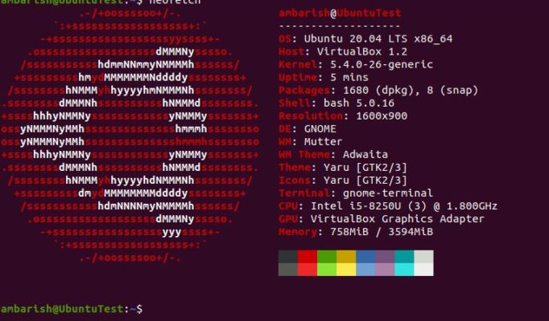
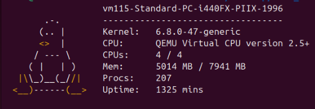
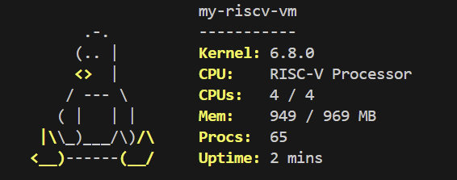
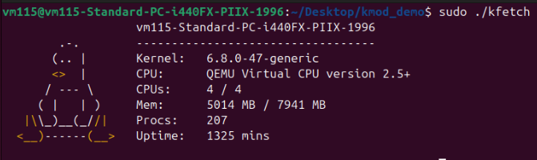
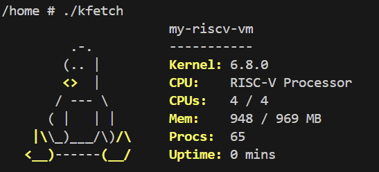
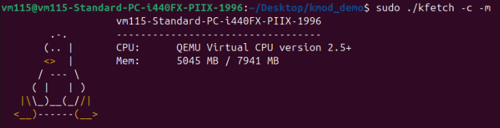
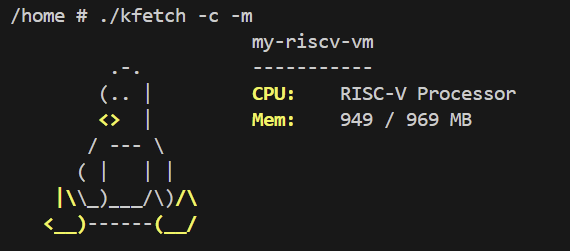
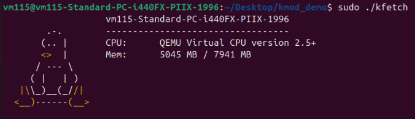
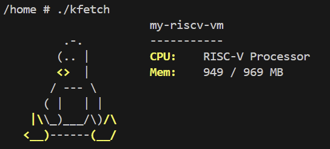

> 原始作業說明：[HackMD](https://hackmd.io/@seco1024/BJYIDp7lZx)


# Assignment III: System Information Fetching Kernel Module

**[NYCU \[CSIC30015\] Operating System](https://timetable.nycu.edu.tw/?r=main/crsoutline&Acy=114&Sem=1&CrsNo=535503&lang=zh-tw) by Prof. [Chun-Feng Wu](https://www.cs.nycu.edu.tw/members/detail/cfwu417)**


<font color="#f00"> **Due Date: 23:59, December 17 (Wednesday), 2025** </font>

---
[TOC] 

## Introdution

Have you ever used the `neofetch` tool? neofetch is a command-line utility that displays system information such as the OS distribution and CPU model.



In this assignment, you are going to implement a kernel module that fetches the system information from the kernel.

<!--  -->



<a id="org493f9b7"></a>

### Linux Kernel Module

A kernel module is a piece of code that can be loaded and unloaded into the kernel dynamically at runtime. This allows the kernel to be extended without the need to recompile the entire kernel. 

You can run `lsmod` to list all loaded modules on the system: 
```
$ lsmod 
Module                  Size  Used by
tls                   110592  0
binfmt_misc            24576  1
intel_rapl_msr         20480  0
intel_rapl_common      40960  1 intel_rapl_msr
snd_hda_codec_generic 102400  1
ledtrig_audio          16384  1 snd_hda_codec_generic
kvm_intel             421888  0
...
```
And you can use `modinfo` to show information about a module. For example, show the information of the module `tls` :
```
$ modinfo tls
filename:       /lib/modules/6.8.0-48-generic/kernel/net/tls/tls.ko
alias:          tcp-ulp-tls
alias:          tls
license:        Dual BSD/GPL
description:    Transport Layer Security Support
author:         Mellanox Technologies
srcversion:     CA655CA00B96B66949E2221
...
```
One thing to keep in mind is that a kernel module exists in kernel space and cannot be written in the same way as a normal C program. This is because functions from the C standard library, such as `printf` and `fopen`, do not exist in the kernel. Likewise, structures like `FILE` and `wchar_t` are not available in the kernel either.


To learn how to write a kernel module, we recommend reading the book [The Linux Kernel Module Programming Guide](https://sysprog21.github.io/lkmpg/). This book has been rewritten by jserv and other contributors to support recent kernel versions (v6.x) and provides a comprehensive guide to writing kernel modules.


<a id="org6d6ee06"></a>

### Assignment Descriptions

In this assignment, you are required to implement a kernel module `kfetch_mod` for RISC-V kernel version **6.8.0**. 

`kfetch_mod` is a character device driver that creates a device called `/dev/kfetch`. The user-space program `kfetch` can retrieve the system information by reading from this device.


<!--  -->


    

Here is a list of the information that your kernel module should retrieve:
- **Kernel**: The kernel release
- **CPU**: The CPU model name
- **CPUs**: The number of CPU cores, in the format `<# of online CPUs> / <# of total CPUs>`
- **Mem**: The memory information, in the format`<free memory> / <total memory>` (in MB)
- **Procs**: The number of processes
- **Uptime**: How long the system has been running, in minutes.


## Kernel Module: `kfetch_mod`

The kernel module `kfetch_mod` is responsible for retrieving all necessary information and providing it when the device is read. Additionally, users can customize the information that kfetch displays by writing a *kfetch information mask* to the device. For example, a user could specify that only the CPU model name and memory information should be shown.

### Kfetch Information Mask

A *kfetch information mask* is a bitmask that determines which information to show. Each piece of information is assigned a number, which corresponds to a bit in a specific position. 

```C
#define KFETCH_NUM_INFO 6

#define KFETCH_RELEASE   (1 << 0)
#define KFETCH_NUM_CPUS  (1 << 1)
#define KFETCH_CPU_MODEL (1 << 2)
#define KFETCH_MEM       (1 << 3)
#define KFETCH_UPTIME    (1 << 4)
#define KFETCH_NUM_PROCS (1 << 5)

#define KFETCH_FULL_INFO ((1 << KFETCH_NUM_INFO) - 1)
```
The mask is set by using bitwise OR operations on the relevant bits. For example, to show the CPU model name and memory information, one would set the mask like this: `mask = KFETCH_CPU_MODEL | KFETCH_MEM`.

### Device Operations

Your device driver must support four operations: open, release, read and write.
```C
const static struct file_operations kfetch_ops = {
    .owner   = THIS_MODULE,
    .read    = kfetch_read,
    .write   = kfetch_write,
    .open    = kfetch_open,
    .release = kfetch_release,
};
```
For the `read` operation, you need to return a buffer that contains the content of the logo and information to the user space. This allows the user to access and use the data from the device. 
```C
static ssize_t kfetch_read(struct file *filp,
                           char __user *buffer,
                           size_t length,
                           loff_t *offset)
{
    /* fetching the information */

    if (copy_to_user(buffer, kfetch_buf, len)) {
        pr_alert("Failed to copy data to user");
        return 0;
    }
    
    /* cleaning up */
}
```
For the `write` operation, a single integer representing the information mask that the user wants to set is passed to the device driver. Subsequent `read` operations will use this mask to determine which information to return to the user. This allows the user to specify which information they want to receive, and the device driver can use the mask to ensure that only the specified information is returned.

```C
static ssize_t kfetch_write(struct file *filp,
                            const char __user *buffer,
                            size_t length,
                            loff_t *offset)
{
    int mask_info;

    if (copy_from_user(&mask_info, buffer, length)) {
        pr_alert("Failed to copy data from user");
        return 0;
    }

    /* setting the information mask */
}
```
 For the `open` and `release` operations, you need to set up and clean up protections, since in a multi-threaded environment, concurrent access to the same memory can lead to race conditions. These protections can take the form of locks, semaphores, or other synchronization mechanisms that ensure that only one thread can access the variables at a time.

<a id="org9c16394"></a>


## Requirements

### Environment Setup

In this assignment, you will continue to use the same environment from [Assignment 1](https://hackmd.io/@fLANt9b6TbWx5I3lYKkBow/S17gcgmKxl), which runs RISC-V programs inside the provided Docker container using QEMU.

**1. Create a New Working Directory in Docker Container**

After getting into the Docker container, create a new folder for this assignment:
```sh
cd /home/ubuntu
mkdir -p hw3
```
All your implementation files for this assignment can be placed here.


**2. Download the Provided Files**
For this assignment, we use kernel version **6.8.0**. To avoid module signature mismatch issues, you must use the official kernel build provided [here](https://drive.google.com/drive/folders/1unzE1tfxv4-rYXd4fFLsifVbyFMwSGn_?usp=sharing). This package contains:
- `Image`: A prebuilt RISC-V Linux kernel Image (v6.8.0)
- `linux-6.8-riscv-devkit.tar.gz`: A compressed kernel development kit (devkit), including headers, `.config`, kernel build scripts, and all necessary architecture files
- `kfetch`: A testing binary used inside QEMU to interact with your kernel module and verify its output
- `kfetch.c` / `kfetch.h`: The source code of the user-space testing program. You may refer to these two files to understand how user space communicates with `/dev/kfetch`, and how the mask is written into the `kfetch` module.

:::warning
**[11/22 Update]**
To avoid issues where students are unable to rebuild the host tools on different host architectures, we now provide two prebuilt versions of the Linux 6.8 RISC-V devkit: `linux-6.8-riscv-devkit-x86_64.tar.gz` and `linux-6.8-riscv-devkit-arm64.tar.gz`. Please download the devkit that matches your host machine architecture.
:::

Copy the provided image and devkit into your homework folder:

```sh
cp <path-to-Image> hw3/
cp <path-to-linux-6.8-riscv-devkit.tar.gz> hw3/
```

Then extract the devkit inside hw3:

```sh
# Please replace the devkit filename with the correct version 
cd hw3
tar -xzf linux-6.8-riscv-devkit.tar.gz
```

<!-- Since each student may use a different host environment, host tools must be regenerated once on your own system. Please enter the devkit directory and rebuild it using:
```sh
cd linux-v6.8-devkit
make clean
make ARCH=riscv CROSS_COMPILE=riscv64-linux-gnu- \
     HOSTCC=gcc HOSTCXX=g++ \
     prepare modules_prepare
``` -->

### Implementation

- The `open` and `release` operations should set up and clean up protections properly.
- The `write` operation should set the information mask in the module, which determines what data is returned by the `read` operation.
- The `read` operation should return data that includes:
    - The given logo
    - Information
        - The first line is the machine hostname, which is mandatory and cannot be disabled
        - The next line is a separator line with a length equal to the hostname
        - The remaining lines depend on the information mask.
    - Note that color support is optional.
- Note that you must release resources such as allocated memory and device major/minor number when the module is removed.

#### Given logo
```
        .-.        
       (.. |       
       <>  |       
      / --- \      
     ( |   | )     
   |\\_)__(_//|   
  <__)------(__>   
```

### Compilation

After finishing your implementation for this assignment, you will need to cross-compile your kernel module as `kfetch_mod_<student_id>.ko`. Your submission must include a working Makefile, and we will compile your module using the `make` command.

When building a kernel module, we are not compiling it directly with gcc. Instead, we ask the Linux kernel build system to compile the module for us. In our case, all kernel-module compilation must use provided `linux-6.8-devkit/` . So your `Makefile` should reference it using something like:

```.sh
# You should adjust based on your own directory structure
KDIR ?= $(PWD)/linux-v6.8-devkit

...

all:
  $(MAKE) ARCH=$(ARCH) CROSS_COMPILE=$(CROSS_COMPILE) -C $(KDIR) M=$(PWD) modules
```

This guarantees that your `.ko` file is binary-compatible with the provided kernel image `Image`.

### Hint
- Linux uses the proc file system to export information about the system, located in the `/proc` directory.
    - For example, memory information can be found in `/proc/meminfo`.
    - The source code can be found at [fs/proc](https://elixir.bootlin.com/linux/latest/source/fs/proc).  You can view the source code to see how the information is retrieved.
- For the hostname and the release, you might want to see [uts_namespaces(7)](https://man7.org/linux/man-pages/man7/uts_namespaces.7.html).
- ~~For the number of threads, you might want to see `nr_threads` variable.~~
- For the number of processes, your output number should be close to the number of the command `top`.


## Test

After compilation, you will need to:
* Copy your  **kernel module (`kfetch_mod_<student_id>.ko`)** and the provided `kfetch` user program into your initramfs folder `/home/ubuntu/initramfs/`, which is the same initramfs directory you have been using in the previous assignments.
* Repack the initramfs.
    ```bash
    cd /home/ubuntu/initramfs/
    find . | cpio -o -H newc | gzip > ../initramfs.cpio.gz
    cd ..
    ```
* Boot into QEMU using the updated initramfs image.
    * Example hostname : my-riscv-vm (you can name it yourself)
    ```bash
    qemu-system-riscv64 -nographic -machine virt -m 1024 -smp 4 \
        -kernel hw3/Image \
        -initrd initramfs.cpio.gz \
        -append "console=ttyS0 loglevel=3 hostname=my-riscv-vm"
    ```
* Install your module:
    ```bash
    insmod kfetch_mod_<student_id>.ko
    ```

You can run `kfetch` with the option `-h` in the QEMU after loading your kernel module:
```sh
$ ./kfetch -h
```

It will show the program usage:
```
Usage:
        ./kfetch [options]
Options:
        -a  Show all information
        -c  Show CPU model name
        -m  Show memory information
        -n  Show the number of CPU cores
        -p  Show the number of processes
        -r  Show the kernel release information
        -u  Show how long the system has been running
```
Initially, when the module is loaded, the first invocation without any options will display all the information. If the options `-c` and `-m` are specified, only the information about the CPU model name and the memory will be displayed.

<!--  -->



Further invocations without any options will print the same information that was specified in the previous call.

<!--  -->



## Grading

- The kernel module can be compiled succesfully. (10%) 
    - **Make sure your kernel module can be built under any directory in the Docker.**
        - Avoid hardcoding paths in your `Makefile`.
    - Also, your `Makefile` should support `make clean`.
    :::danger
    **Remark:** If your `Makefile` fails the above requirements, you are very likely to get **zero score**, since your submission will fail our automated build system.
    :::
- Your module can be `insmod`/`rmmod` in the QEMU succesfully. (10%) 
- Once your module is loaded, it should automatically create the required `kfetch` device file under the `/dev` directory (i.e. `/dev/kfetch`). **Otherwise, you may not receive the subsequent scores, since our testcases may not be able to find your device node.** (10%)
<!-- - The user-space program `kfetch` can set the information mask successfully. (25%): -->
- The user-space program `kfetch` can display the following information correctly. (60%):
    - Hostname and the seperation line (5%)
    - Kernel (5%) 
    - CPU (10%)
    - CPUs (10%)
    - Mem (10%)
    - Proc (10%)
    - Uptime (10%)
- **Hidden testcase:** Your kernel module must be **thread-safe**. (10%) 
Make sure your character driver can hanlde concurrent access correctly. Note that we may use `fork()` to spawn multiple processes to test your character device driver.
<a id="org2b37a31"></a>
    :::success
    **💡Hint:** 
    You may use the [mutex_lock](https://elixir.bootlin.com/linux/v6.12/source/include/linux/mutex.h#L178) and [mutex_unlock](https://elixir.bootlin.com/linux/v6.12/source/include/linux/mutex.h#L197) function to protect shared variables, you can declare the lock as a global variable using the [DEFINE_MUTEX(mutexname)](https://elixir.bootlin.com/linux/v6.12/source/include/linux/mutex.h#L86) marco.
    :::
    
    :::success
    **Update:** 
    As long as your output block is not corrupted, you will get the points.
    Example of corrupt output:
    ```
            .-.        vm115
       (.. |               .-.        ---------------------
    C              PU   (.. |       
       <>  |       
      / --- \      Mem     1569 M    B/81   92MB
     ( |          .-.        
       (.. |       
     
   |\\_)__(_//|   
  <__)------(__>    | )     
       <>  |       
      / --- \      
     ( |   | )     
   |\\_)__(_//|   
  <__)------(__>   
    ```
    Your code should ensure atomicity for both read and write operations. This means that if two processes, A with the -c option and B with the -m option, produce the same output, the outcome will still be considered correct.
    :::

## Submission

Please submit a **zip** file to E3, which contains your program sources.

-   The program must implemented using C.
-   Make sure your code can be compiled with `make` command in **Docker** and `insmod`/`rmmod` in the **RISC-V QEMU**.
    -   `make` should compile the kernel module sources.
    -   `make clean` should clean the directory of non-essential files.
<!--     -   ~~The `student_id`~~ -->


The name of the zip file should be `<student_id>.zip`, and the structure of the file should be as the following:
```
<student_id>.zip
    |- <student_id>/
        |- Makefile
        |- kfetch_mod_<student_id>.c
        |- other files (if you have any)
```
:::info
You don't need to use Makefile to `load`/`unload` your kernel module since QEMU doesn't provide `make` command.
:::

:::danger
:warning: **Attention**. You will get *NO POINT* when

* do not follow the submission rule including file name and format.
* cheating including any suspected **PLAGIARISM** in source code.
:::
